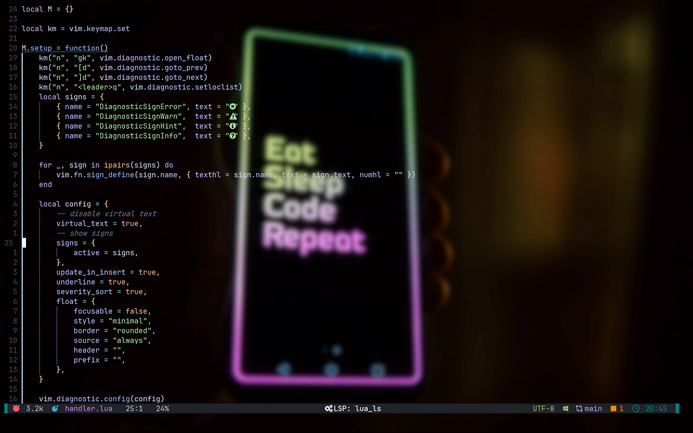
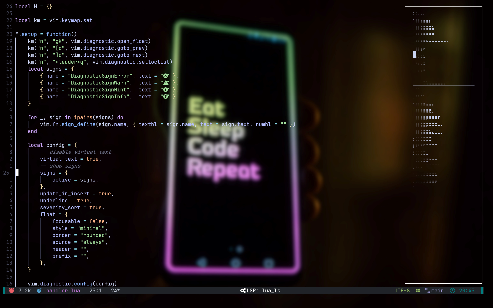
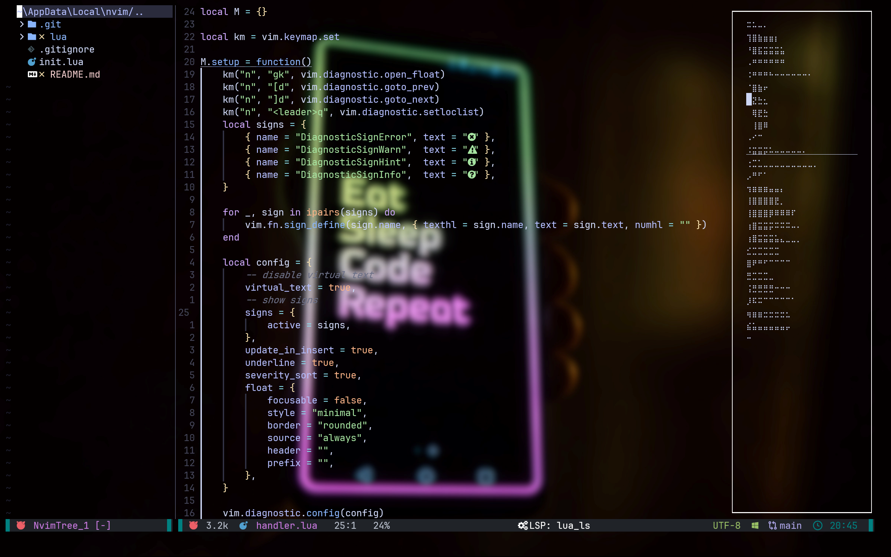
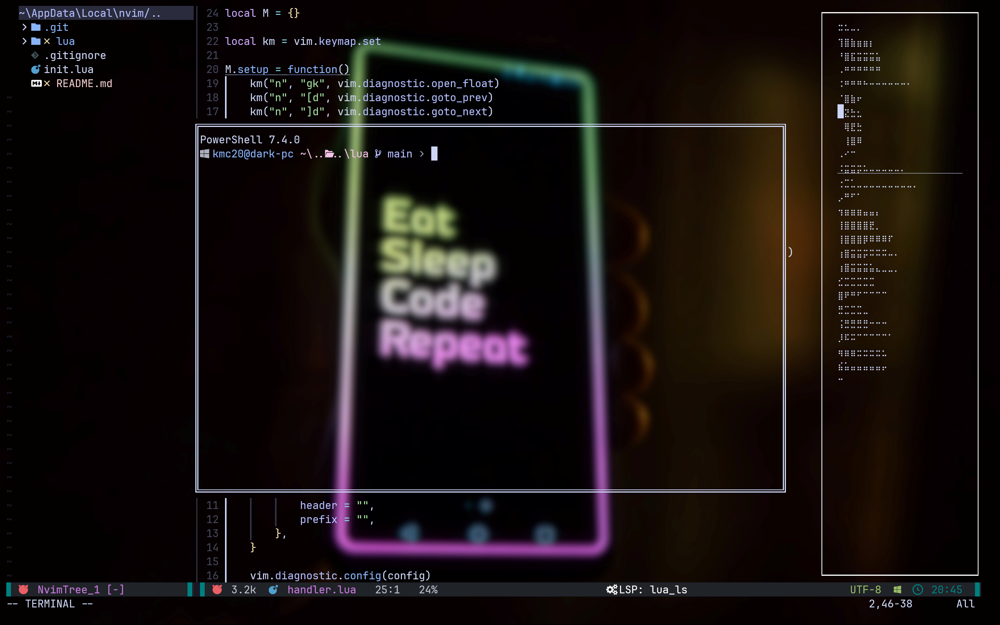

# nvim_config_darkchoclate
My personalized minimalist neovim config

## Screenshots

## Installation
1. Install neovim
2. Clone this repo to ~/.config/nvim if linux or %userprofile%\AppData\Local\nvim if windows
3. Install nerd fonts from https://www.nerdfonts.com/font-downloads

## Dependencies
1. To use copilot and pyright make sure to install nodejs and npm.
2. To use the telescope file finder make sure to install ripgrep.
3. Gopls may throw error if you don't have go installed.
To solve this either install go or
goto lua/configs/mason.lua and remove gopls from ensure_installed list.
4. To use copilot make sure to first run :Copilot auth command and link your github account.

## Extra Keybindings
- The default keybindings are still available.
- The leader key is set to space.
### General
- `jk` in insert mode: Exit to normal mode.
- `Ctrl + h` in normal mode: Navigate to the window on the left.
- `Ctrl + j` in normal mode: Navigate to the window below.
- `Ctrl + k` in normal mode: Navigate to the window above.
- `Ctrl + l` in normal mode: Navigate to the window on the right.
- `<leader> + x` in normal mode: Close the current buffer.

### Telescope
- `<leader>ff` in normal mode: Find files using Telescope.
- `<leader>fg` in normal mode: Live grep using Telescope.
- `<leader>fb` in normal mode: List all open buffers using Telescope.
- `<leader>fh` in normal mode: List all help tags using Telescope.

### LSP
- `gk` in normal mode: Open the diagnostic float.
- `[d` in normal mode: Go to the previous diagnostic.
- `]d` in normal mode: Go to the next diagnostic.
- `<leader>q` in normal mode: Set the diagnostic to the location list.
- `gD` in normal mode: Go to declaration.
- `gd` in normal mode: Go to definition.
- `K` in normal mode: Hover to view documentation.
- `gi` in normal mode: Go to implementation.
- `<leader>wa` in normal mode: Add workspace folder.
- `<leader>wr` in normal mode: Remove workspace folder.
- `<leader>wl` in normal mode: List workspace folders.
- `<leader>fm` in normal mode: Format the document.
- `<leader>rn` in normal mode: Rename the current symbol.
- `<leader>ca` in normal mode: Show code actions.
- `gr` in normal mode: Show references.

### Flutter
- `<leader>fc` in normal mode: List all Flutter commands using Telescope.

### Toggleterm
- `<esc>` or `jk` in terminal mode: Exit to normal mode.
- `Ctrl + h` in terminal mode: Navigate to the window on the left.
- `Ctrl + j` in terminal mode: Navigate to the window below.
- `Ctrl + k` in terminal mode: Navigate to the window above.
- `Ctrl + l` in terminal mode: Navigate to the window on the right.
- `Ctrl + w` in terminal mode: Close the terminal window.
- `Alt + i` in normal or terminal mode: Toggle the floating terminal.
- `<leader>th` in normal mode: Open a new horizontal terminal.
- `<leader>tb` in normal mode: Open a new terminal in a new tab.
- `<leader>ts` in normal mode: Select a terminal to interact with.
- `<leader>trn` in normal mode: Rename the current terminal.